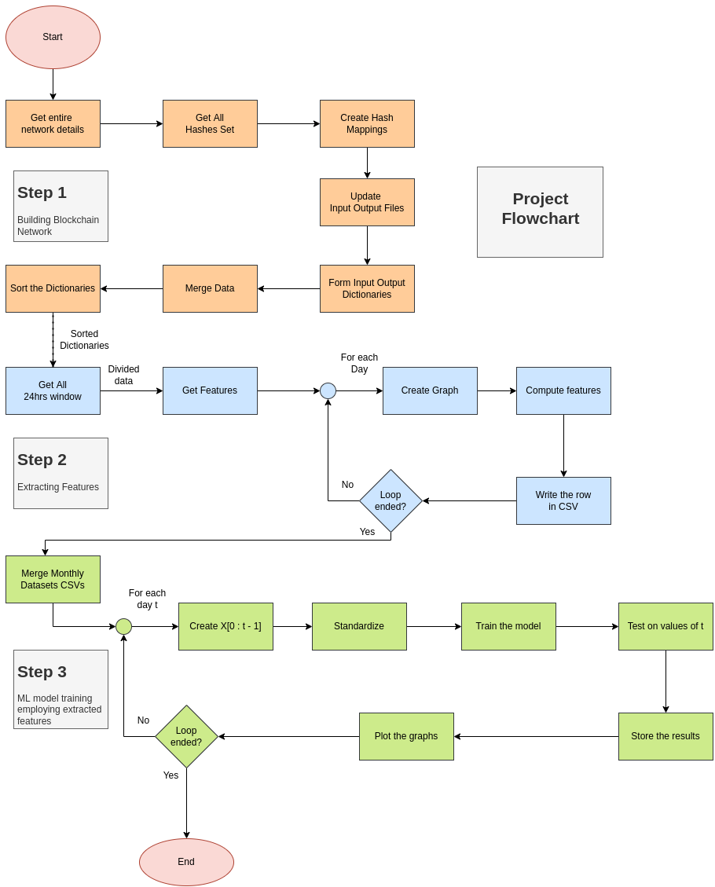
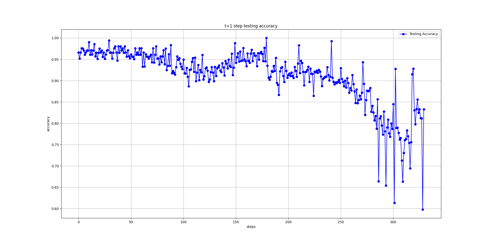
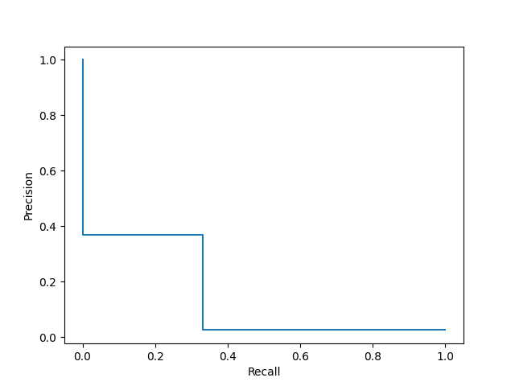
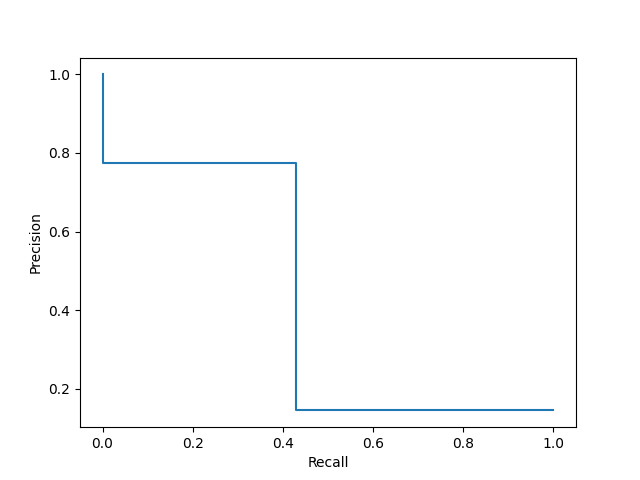

# BitcoinHeist: Topological Data Analysis for Ransomware Detection on the Bitcoin Blockchain
[//]: # "Description"
This project is an attempt to replicate the process of ransomeware detection explained in the paper. [[1]]

[//]: # "Code Structure"
### Code Structure
The repo is divided into the following directories.
- **Data**: This holds all the input/output files. Which includes before, during and after running the code.
- **Logs**: This hold a log file, which has all the logs that are created whilst running the code. 
- **Notebooks**: Interactive python notebooks that were used for creating and devloping the code
- **Plots**: All the graphs/diagrams created while running the code.
- **Src**: Actual code is stored here, _main.py_ is the driver module.
- **Other_files**: some other code files
****

[//]: # "Instalation"

### Installation
This project uses a lot of uncommon libraries like, stella, ipgraph etc. <br /> To install them run the following command in your terminal.<br /> 
```{.python}
pip3 install -r /path/to/requirements.txt
```
****
[//]: # "Run the code"
### Run the code
To run the code run the follwoing code from the parent folder. <br /> 
```{.python}
python3 src/main.py 
```
The code requires heavy computational power and can take a lot of time. <br /> 
One can change values in _constants.py_ as per requirements. 
****
[//]: # "Flow of the code"
### Flow of the code
The code starts from _main.py_ and is divided into modules depending on the following steps. Figure explains the flow of the code
****


[//]: # "Limitations"
### Limitations
The code has the following shortcomings
- The code can only handle datasize till year 2013.
- To optimize performance the code is designed to complete the process monthly. It's later merged into one.
- The whole code can be further optimized to run more efficiently
****
[//]: # "Results"
### Results
> t step accuracy 


> precision recall graph comparison 
> - towards the start of training


> - towards the end of training


****
[//]: # "References"

### References
- A [1]: http://chartalist.org/BitcoinData.html
- A [2]: http://www.chartalist.org/btc/TaskTypePrediction.html
<<<<<<< Updated upstream
****
=======
****
>>>>>>> Stashed changes
